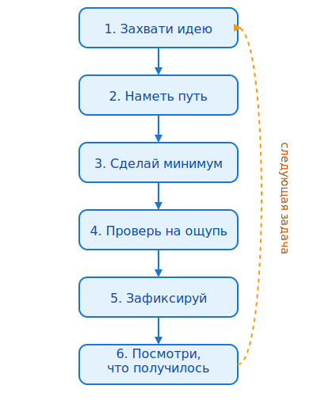

# 04. Творческая петля

Работа с агентом — не ритуал. Это прототипирование: идея, план, минимум, проверка, рефлексия. Шесть шагов, которые повторяются, пока вещь не готова.

> **Вердикт:** каждый цикл должен рождать что-то осязаемое.

---

## Схема



*Шаги: 1. Захвати идею → 2. Наметь путь → 3. Сделай минимум → 4. Проверь на ощупь → 5. Зафиксируй → 6. Посмотри, что получилось.*

## Шаг 1. Захвати идею

Сформулируй задачу одним предложением. Если не получается — идея слишком большая, разбей.

- ✅ «Добавить сортировку заказов по дате в личном кабинете»
- ❌ «Сделать личный кабинет удобнее»

Хорошая идея звучит как результат, который можно потрогать.

---

## Шаг 2. Наметь путь

Не пиши код, пока не согласовали план. План — твой эскиз.

Пример промпта:

```text
Хочу добавить сортировку заказов по дате в личном кабинете.
Сначала предложи план в 3-5 шагов. Без кода.
```

Если план разрастается — сузь:

```text
План выглядит перегруженным.
Предложи более простой вариант в 3 шага, без новой архитектуры.
```

Планирование напрямую опирается на принципы из [03-principles.md](03-principles.md).

---

## Шаг 3. Сделай минимум

Агент пишет. Ты следишь: мало файлов, простое решение, нет кода на потом.

Если агент несёт большой кусок — разбей:

```text
Это слишком большой шаг.
Сначала backend: репозиторий + контроллер. UI не трогай.
```

---

## Шаг 4. Проверь на ощупь

Три проверки:

1. **Тесты.** Запусти релевантные. Если их нет — проверь вручную.
2. **Diff.** Прочитай, что изменилось.
3. **Здравый смысл.** Решает ли это задачу? Есть ли побочки?

После тестов попроси агента самого пройтись по чеклисту:

```text
Проверь изменение:
1) все ли ветки кода покрыты,
2) какие очевидные edge-cases есть,
3) не затронут ли лишние файлы.
```

**Технический чеклист:**

```bash
# Тесты
npm test          # или pytest, cargo test, go test

# Линтер
npm run lint      # или ruff, eslint, golangci-lint

# Типы
npm run typecheck # или mypy, tsc, cargo check
```

Выбирай команды проекта. Если их нет — добавь до агента.

Чеклист для приёмки diff — в [09-checklists.md#before-accept](09-checklists.md#before-accept).

---

## Шаг 5. Зафиксируй

Коммит — не формальность. Это точка сохранения творческого эксперимента.

```bash
git add src/orders/service.py
git commit -m "feat: sort orders by date in profile"
```

Сообщение отвечает на вопрос «что изменилось?».

---

## Шаг 6. Посмотри, что получилось

Рефлексия — не эссе. Две-три строки, которые помогут следующей сессии.

Задай себе:

1. Что сработало?
2. Что можно было сделать быстрее?
3. Что исправить в следующий раз?

Пример:

```text
+ План из 4 шагов был понятен.
- Поздно заметил лишний логгер в diff.
→ В следующий раз: сначала diff, потом тесты.
```

---

## Успешная гладкая сессия

```text
Ты: Добавь сортировку заказов по дате в личном кабинете.
Агент: План: 1) параметр sort в запросе, 2) helper сортировки, 3) UI-кнопка.
Ты: Начни с backend. UI потом.
Агент: [пишет helper и endpoint]
Ты: [смотрит diff] Ок, запускаю тесты.
Ты: Тесты прошли. Добавь кнопку в UI.
Агент: [пишет кнопку]
Ты: [проверяет вручную] Работает. Коммит.
```

Всё гладко: идея ясная, план короткий, минимум ограничен backend, проверка прошла без сюрпризов.

## Плохая сессия → рестарт по правилам

```text
Ты: Нужен экспорт заказов в CSV из личного кабинета.
Агент: План: 1) добавить endpoint /orders/export, 2) использовать pandas для генерации CSV,
        3) кнопка в UI.
Ты: pandas — лишняя зависимость для одного CSV. Предложи вариант без pandas.
Агент: Ок, использую стандартный csv-модуль. 1) endpoint, 2) генерация через csv.writer,
        3) кнопка.
Ты: Начни с backend. UI потом.
Агент: [пишет endpoint и сервис]
Ты: [смотрит diff] Здесь ты добавил генерацию файла на диск. Нам нужен streaming response,
      не файл.
Агент: [переделывает на StreamingResponse]
Ты: [запускает тесты] Падает 1 тест: не хватает заголовка Content-Disposition.
Агент: [добавляет заголовок]
Ты: [проверяет вручную] Работает.
Ты: git commit -m "feat: export orders to CSV"
```

Что здесь произошло: идея была ясной, план сократили, минимум ограничили backend, а тупик с файлом разрулили уточнением формата ответа.

---

Следующий шаг: узнай, как эта петля работает в конкретном редакторе — [05-environments.md](05-environments.md).

Если что-то пошло не так — вернись к принципам в [03-principles.md](03-principles.md).
